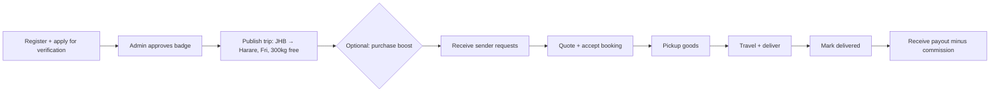
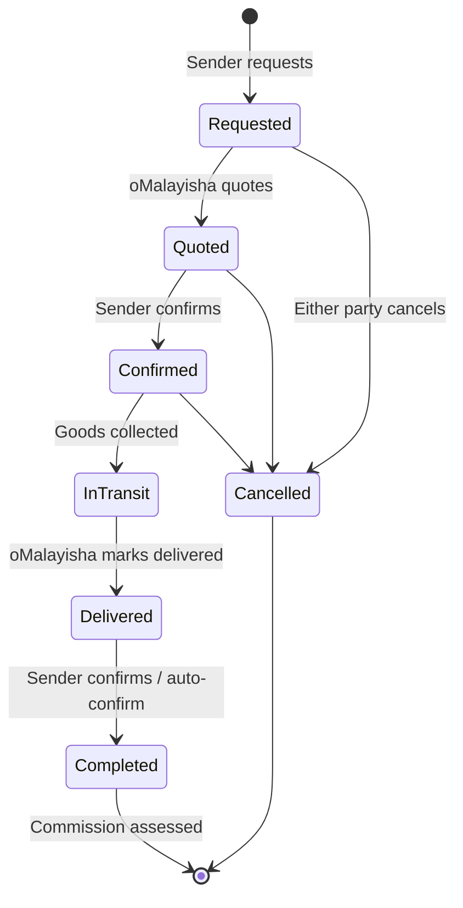
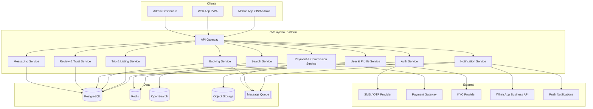
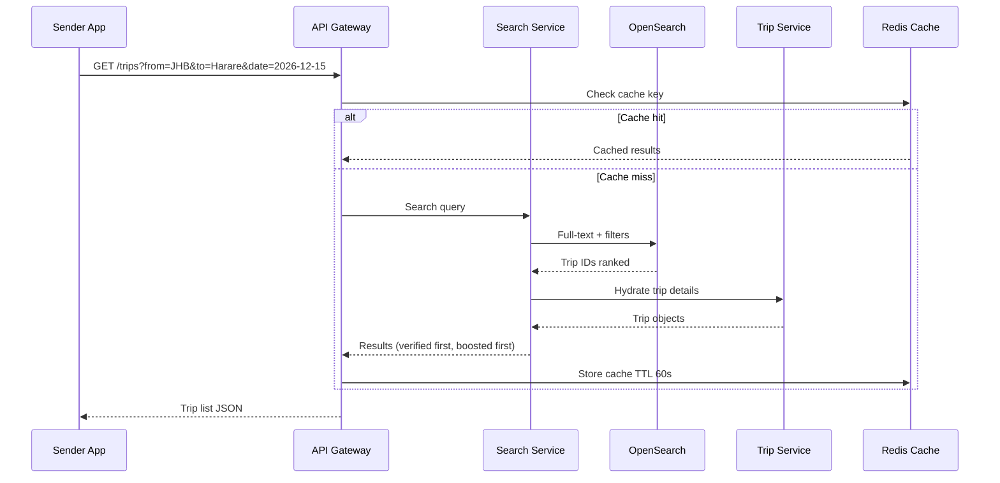
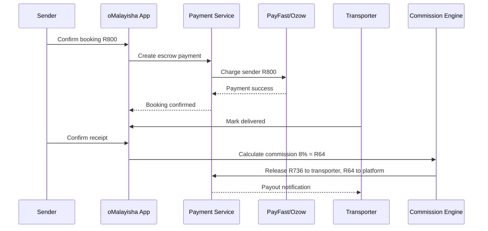
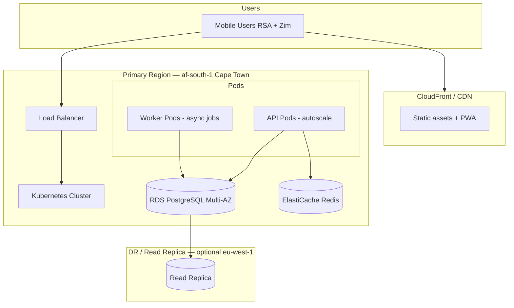
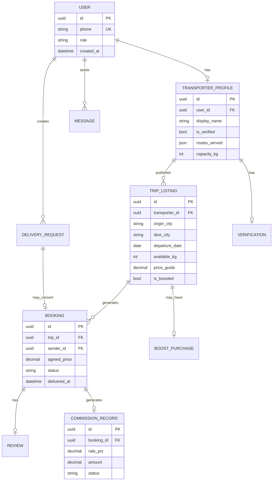

# oMalayisha — Product & Technical Plan

**Version:** 1.0  
**Date:** June 2026  
**Status:** Pre-MVP / Partner alignment  
**Confidential:** For internal partners and stakeholders only

---

## Table of Contents

1. [Executive Summary](#1-executive-summary)
2. [Problem Statement](#2-problem-statement)
3. [Solution Overview](#3-solution-overview)
4. [Target Users & Personas](#4-target-users--personas)
5. [Revenue Model (Tier 1)](#5-revenue-model-tier-1)
6. [Product Features & Roadmap](#6-product-features--roadmap)
7. [User Journeys](#7-user-journeys)
8. [System Architecture](#8-system-architecture)
9. [Suggested Tech Stack](#9-suggested-tech-stack)
10. [Data Model (High Level)](#10-data-model-high-level)
11. [Security, Trust & Compliance](#11-security-trust--compliance)
12. [Go-to-Market: Zero to Hero](#12-go-to-market-zero-to-hero)
13. [Key Metrics (KPIs)](#13-key-metrics-kpis)
14. [Risks & Mitigations](#14-risks--mitigations)
15. [Team & Roles (Suggested)](#15-team--roles-suggested)
16. [Budget Phases (Indicative)](#16-budget-phases-indicative)
17. [Appendix: Glossary](#17-appendix-glossary)

---

## 1. Executive Summary

**oMalayisha** is a trust-first marketplace connecting **senders** (Zimbabwean workers and families in South Africa) with **oMalayisha** (informal cross-border goods transporters travelling to Zimbabwe).

Hundreds of thousands of people already move groceries, furniture, building materials, clothing, and parcels between RSA and Zimbabwe every month — almost entirely through **WhatsApp groups, Facebook posts, and word-of-mouth**. There is no dominant platform that solves **discovery, trust, booking, and payment** in one place.

oMalayisha will become the **verified directory + booking layer** for this informal logistics network, monetizing through **commission on completed deliveries**, **featured listings**, and **paid verification** — without charging senders to browse or post requests.

| Item | Detail |
|------|--------|
| **Market** | RSA ↔ Zimbabwe cross-border informal logistics |
| **Beachhead** | Johannesburg/Pretoria → Harare/Bulawayo |
| **Business model** | B2B2C — transporters pay; senders use free |
| **Moat** | Verified transporters, route-specific reviews, in-app booking trail |
| **Launch strategy** | One corridor, manual concierge, then automate |

---

## 2. Problem Statement

### 2.1 For Senders (Customers in RSA)

| Pain | Impact |
|------|--------|
| No central place to find transporters | Hours spent scrolling WhatsApp/Facebook |
| Trust uncertainty | Scams, lost goods, no accountability |
| Opaque pricing | No standard rates; haggling with no benchmarks |
| Poor coordination | Pickup timing, capacity (kg/m³), destination suburbs unclear |
| No delivery proof | Families in Zim don't know when goods will arrive |

### 2.2 For Receivers (Families in Zimbabwe)

| Pain | Impact |
|------|--------|
| Unpredictable arrivals | Cannot plan collection or storage |
| No tracking | "Did the bag leave JHB yet?" |
| Disputes | Hard to prove what was sent vs received |

### 2.3 For oMalayisha (Transporters)

| Pain | Impact |
|------|--------|
| Inconsistent demand | Feast-or-famine; empty return trips |
| Reputation trapped in DMs | New customers can't find them |
| Price competition in groups | Race to the bottom in public chats |
| Admin overhead | Managing dozens of WhatsApp threads manually |

### 2.4 Market Gap

```
Today:     Sender ──(WhatsApp/Facebook)──► Transporter ──► Receiver
           • No verification
           • No structured search
           • No booking record
           • No platform economics

Tomorrow:  Sender ──(oMalayisha App)──► Verified Transporter ──► Receiver
           • Trust layer
           • Route + date matching
           • Booking + commission
           • Reviews per corridor
```

**The problem is not moving goods — it's moving trust and information efficiently.**

---

## 3. Solution Overview

oMalayisha is a **two-sided marketplace** that:

1. Lets **senders post delivery requests** or browse **transporter trip listings** (route, date, capacity, price guide).
2. Lets **oMalayisha publish trips**, receive leads, and manage bookings.
3. Provides **verification, reviews, in-app chat, and booking confirmation** as the trust layer.
4. Collects **platform revenue from transporters** on successful outcomes and premium visibility.

### 3.1 Value Proposition

| Audience | Promise |
|----------|---------|
| **Senders** | "Find a verified oMalayisha going to your home area — free, fast, trusted." |
| **oMalayisha** | "Get more customers on your route — pay only when you earn (commission) or for visibility (boost)." |
| **Receivers** | "Know who is carrying your goods and when they are expected." (Phase 2+) |

### 3.2 Positioning

> **Not a logistics company.** oMalayisha is a **connection and trust platform**. Transporters remain independent operators; we facilitate discovery, booking records, and reputation.

### 3.3 Competitive Landscape

| Alternative | Weakness vs oMalayisha |
|-------------|------------------------|
| WhatsApp groups | No search, no verification, no booking history |
| Facebook Marketplace | Not route-specific; high scam rate |
| Formal couriers (DHL, etc.) | Expensive; not suited for bulk groceries/furniture |
| Word of mouth | Doesn't scale; excludes new transporters |

---

## 4. Target Users & Personas

### Persona A: **Mike** — Sender (RSA)

- Zimbabwean worker in Johannesburg, sends groceries monthly to family in Bulawayo
- Uses WhatsApp daily; smartphone-first; price-sensitive
- Needs: trustworthy transporter, known departure date, fair price
- Will **not** pay to browse; will pay for **optional** insurance/escrow later

### Persona B: **Blessing** — oMalayisha (Transporter)

- Drives JHB → Bulawayo 2–4 times per month
- 500kg–1 ton capacity; mixes groceries and parcels
- Needs: fill capacity, repeat customers, less time in group chats
- **Will pay** for customers and visibility if ROI is clear

### Persona C: **Grace** — Receiver (Zimbabwe)

- Collects goods on behalf of family in Bulawayo
- Needs: ETA notification, transporter contact, proof of handoff
- Secondary user initially; notification-focused features in Phase 2

---

## 5. Revenue Model (Tier 1)

All Tier 1 revenue is collected from **oMalayisha (supply side)**. **Senders use the platform free** for browsing, posting, and booking.

### 5.1 Revenue Stream 1: Commission on Completed Bookings (Primary)

| Attribute | Detail |
|-----------|--------|
| **Rate** | 5–10% of agreed trip/booking value |
| **Trigger** | Booking marked **delivered & confirmed** (sender or auto-confirm after window) |
| **Who pays** | oMalayisha (deducted from payout if escrow enabled, or invoiced) |
| **Example** | R800 trip → R40–80 platform fee |

**Why primary:** Aligns platform success with transporter success. Scales with volume.

**Implementation phases:**

| Phase | Mechanism |
|-------|-----------|
| MVP | Manual commission tracking; monthly invoice to transporter |
| Growth | In-app payment; commission auto-deducted from escrow payout |
| Scale | Smart pricing by route/demand; volume discounts for top transporters |

**Off-platform leakage mitigation:**

- In-app chat (audit trail)
- Reviews only for in-app completed bookings
- Escrow: sender pays platform → transporter paid on delivery confirm
- Repeat-booking prompts: "Book again with [verified oMalayisha]"

### 5.2 Revenue Stream 2: Featured / Boosted Listings

| Attribute | Detail |
|-----------|--------|
| **What** | Trip or profile appears at top of search for matching route/date |
| **Pricing** | R50–200 per boost (dynamic by route demand) |
| **Duration** | 24–72 hours or until trip departs |
| **Analogy** | Facebook Marketplace boost — familiar to target users |

**Example boosts:**

- "JHB → Harare, leaving Friday" — R150 for 48h top placement
- "CPT → Bulawayo" — R80 (lower demand corridor)

### 5.3 Revenue Stream 3: Verification Badge

| Attribute | Detail |
|-----------|--------|
| **What** | ID verification, vehicle photos, route references, platform background check |
| **Badge** | "Verified oMalayisha" on profile and search results |
| **Pricing** | R200–500/year (or bundled in future subscription) |
| **Moat** | Primary differentiator vs WhatsApp |

**Verification checklist (MVP):**

- [ ] South African ID or passport
- [ ] Driver's licence
- [ ] Vehicle registration + photos (plate, load area)
- [ ] 2 reference contacts (previous customers)
- [ ] Manual admin approval (automate later with KYC provider)

### 5.4 Revenue Summary Table

| Stream | Payer | Timing | MVP | At Scale (illustrative) |
|--------|-------|--------|-----|-------------------------|
| Commission 5–10% | oMalayisha | On delivery confirm | Manual | Automated via escrow |
| Featured boost | oMalayisha | Upfront | Manual payment | In-app purchase |
| Verification | oMalayisha | Annual | Manual review | API-driven KYC |

### 5.5 Unit Economics Example (Single Corridor, Year 1 Target)

**Assumptions:** 400 completed bookings/month, avg trip value R700, 8% commission, 20 boosts/month @ R100, 50 new verifications/year @ R350

| Line | Monthly (ZAR) |
|------|---------------|
| Commission (400 × R700 × 8%) | R22,400 |
| Boosts (20 × R100) | R2,000 |
| Verification (amortized) | ~R1,458 |
| **Total** | **~R25,858/mo** |

At 2,000 bookings/month with automation: **~R112k+/mo** from commission alone (excluding boosts and verification).

---

## 6. Product Features & Roadmap

### 6.1 MVP (Months 1–3) — "Trust + Match"

**Senders (Customers)**

- [ ] Register / login (phone OTP)
- [ ] Post delivery request (from, to, date needed, weight/size, description)
- [ ] Browse transporter trip listings
- [ ] Search/filter by route, date, price, verified badge
- [ ] In-app chat with transporter
- [ ] Book trip (agreed price recorded)
- [ ] Mark delivered + leave review
- [ ] Share trip/listing via WhatsApp link

**oMalayisha (Transporters)**

- [ ] Register / login (phone OTP)
- [ ] Create profile (routes served, vehicle capacity, photo)
- [ ] Publish trip (departure date, route, available kg, price guide)
- [ ] Receive and respond to requests
- [ ] Accept/decline bookings
- [ ] Mark in-transit / delivered
- [ ] Apply for verification badge
- [ ] Purchase featured boost (manual v1)

**Admin**

- [ ] Approve verifications
- [ ] Moderate reviews and disputes
- [ ] View bookings and commission owed
- [ ] Manage featured listings

### 6.2 Growth (Months 4–9)

- [ ] Escrow payments (PayFast / Ozow / card)
- [ ] Auto commission deduction on payout
- [ ] Receiver notifications (SMS/WhatsApp): "Goods in transit"
- [ ] Photo proof at pickup and delivery
- [ ] Repeat booking / favourite transporters
- [ ] Route demand insights for transporters
- [ ] In-app boost purchase (automated)
- [ ] Multi-language: English, Shona, Ndebele

### 6.3 Scale (Months 10–18)

- [ ] Full KYC automation (Smile ID, Onfido, or local provider)
- [ ] Dispute resolution workflow
- [ ] Insurance partner integration
- [ ] API for churches, NGOs, remittance partners (bulk senders)
- [ ] USSD or SMS-lite for low-smartphone users
- [ ] Dynamic boost pricing by corridor demand
- [ ] Transporter analytics dashboard (conversion, earnings, ratings)

### 6.4 Feature Priority Matrix

| Feature | User Value | Revenue Impact | Effort | Phase |
|---------|------------|----------------|--------|-------|
| Trip listings + search | High | Medium | Medium | MVP |
| Verification badge | High | High | Low (manual) | MVP |
| In-app chat | High | Medium | Medium | MVP |
| Reviews | High | High | Low | MVP |
| Commission tracking | Medium | High | Low | MVP |
| Escrow payments | High | High | High | Growth |
| Featured boosts | Medium | High | Low | MVP (manual) |
| Receiver tracking | Medium | Low | Medium | Growth |

---

## 7. User Journeys

### 7.1 Sender Journey (Happy Path)

```mermaid
flowchart LR
    A[Download app] --> B[Post request or browse trips]
    B --> C[Filter: JHB → Bulawayo, Dec 15]
    C --> D[View verified oMalayisha profiles]
    D --> E[Chat + agree price]
    E --> F[Confirm booking in app]
    F --> G[Hand over goods at pickup]
    G --> H[Receiver gets goods]
    H --> I[Mark delivered + review]
    I --> J[Platform records commission]
```



### 7.2 oMalayisha Journey (Happy Path)



### 7.3 Booking State Machine



---

## 8. System Architecture

Designed for **millions of users** with horizontal scaling, clear service boundaries, and mobile-first access patterns.

### 8.1 High-Level Architecture (C4 Context)



### 8.2 Request Flow — Search Trips



### 8.3 Booking + Commission Flow (Growth Phase with Escrow)



### 8.4 Deployment Topology (Production)



**Scaling principles:**

- **Stateless API** containers behind load balancer (scale on CPU/RPS)
- **PostgreSQL** for transactional integrity (bookings, payments, users)
- **Read replicas** for search-heavy and reporting queries
- **Redis** for sessions, OTP, rate limiting, hot listing cache
- **OpenSearch** for trip/route search at scale
- **SQS/RabbitMQ** for notifications, commission jobs, webhooks
- **CDN** for images, static app shell (PWA)
- **Multi-AZ** within region first; cross-border latency optimized via CDN + edge caching

---

## 9. Suggested Tech Stack

Stack chosen for **fast MVP**, **strong hiring pool**, and **proven scale to millions**.

### 9.1 Client Applications

| Layer | Technology | Rationale |
|-------|------------|-----------|
| Mobile | **React Native** (Expo) | One codebase iOS + Android; OTA updates; large dev community |
| Web / PWA | **Next.js 15** | SEO for marketing pages; PWA for desktop users |
| Admin | **Next.js** + shadcn/ui | Shared TS ecosystem with API |

**Alternative:** Flutter if team has stronger Dart capacity.

### 9.2 Backend

| Layer | Technology | Rationale |
|-------|------------|-----------|
| API | **ASP.NET Core 8+** (C#) | High performance; strong typing for bookings/payments; excellent DI; proven at scale |
| Architecture | **Clean Architecture** + MediatR | Keeps business logic out of controllers; testable use cases (bookings, commission, verification) |
| ORM | **Entity Framework Core** + Npgsql | ACID transactions for bookings and commission; migrations; PostgreSQL-native |
| API style | REST + **OpenAPI** (Swagger) | Simple for mobile; auto-generate TypeScript client for React Native via NSwag/Kiota |
| Real-time chat | **SignalR** | First-class .NET WebSockets; hubs for sender ↔ transporter messaging |
| Auth | **Phone OTP** + JWT (Bearer) | ASP.NET Identity or custom; matches WhatsApp phone culture |
| Validation | **FluentValidation** | Request/rules validation aligned with use cases |
| Background jobs | **Hangfire** or **MassTransit** | Commission processing, notifications, boost expiry |
| File uploads | Pre-signed URLs → **S3** (AWS SDK for .NET) | Vehicle photos, proof of delivery |
| Caching | **StackExchange.Redis** | Sessions, OTP, rate limits, listing cache |

**Why C# fits oMalayisha:** This is a **transaction-heavy marketplace** (bookings, state machines, commission, escrow). C# excels at complex domain logic, financial calculations, and long-running reliable services. ASP.NET Core consistently ranks among the fastest web frameworks and runs efficiently on Linux containers in AWS.

**Frontend ↔ backend contract:** No shared runtime types with React Native — generate TypeScript API clients from OpenAPI on each API release. This is a solved workflow and not a blocker.

**Alternative at scale:** Extract hot paths (search indexing, notification fan-out) into dedicated workers or services when metrics justify — same pattern as any monolith.

### 9.3 Data & Infrastructure

| Layer | Technology | Rationale |
|-------|------------|-----------|
| Primary DB | **PostgreSQL 16** | ACID for bookings/payments; JSONB for flexible metadata |
| Cache | **Redis** | Sessions, OTP, rate limits, listing cache |
| Search | **OpenSearch** | Route/date/city search; boosted ranking |
| Queue | **AWS SQS** + **MassTransit**, or **Hangfire** (Redis/SQL) | Async notifications, commission processing |
| Storage | **AWS S3** | Images, documents |
| CDN | **CloudFront** | Static assets, image delivery |
| Orchestration | **AWS EKS** (Kubernetes) or **ECS Fargate** | Auto-scaling; start with ECS if team is smaller |
| IaC | **Terraform** | Reproducible environments |
| CI/CD | **GitHub Actions** | Build, test, deploy pipelines |
| Monitoring | **Datadog** or **Grafana + Prometheus** | APM, logs, alerts |
| Error tracking | **Sentry** | Mobile + backend crash reporting |

### 9.4 Third-Party Integrations (RSA-focused)

| Purpose | Provider Options |
|---------|------------------|
| SMS / OTP | Twilio, Africa's Talking, Clickatell |
| Payments | PayFast, Ozow, Yoco (escrow/settlement build required) |
| KYC / ID | Smile Identity, ThisIsMe (SA) |
| Push | Firebase Cloud Messaging |
| WhatsApp | WhatsApp Business API (booking updates) |
| Maps | Google Maps Platform (pickup points, suburbs) |

### 9.5 Solution Structure (Suggested)

```
malayisha/
├── src/
│   ├── Malayisha.Api/              # ASP.NET Core Web API (controllers / minimal APIs)
│   ├── Malayisha.Application/      # Use cases, MediatR handlers, DTOs, validators
│   ├── Malayisha.Domain/           # Entities, enums, domain rules (booking states, commission)
│   └── Malayisha.Infrastructure/   # EF Core, Redis, S3, SMS, payment gateways, SignalR
├── tests/
│   ├── Malayisha.Application.Tests/
│   └── Malayisha.Api.IntegrationTests/
├── apps/
│   ├── mobile/                     # React Native (Expo)
│   ├── web/                        # Next.js marketing + PWA
│   └── admin/                      # Next.js admin dashboard
├── infra/
│   └── terraform/                  # AWS infrastructure
└── docs/
    └── PRODUCT_PLAN.md
```

**MVP shortcut:** Single ASP.NET Core solution + Expo app + Postgres on **Railway**, **Azure App Service**, or **AWS ECS** for first 3 months; migrate to EKS when >50k MAU or funding secured.

### 9.6 Scale Milestones → Infra Evolution

| Stage | Users | Architecture |
|-------|-------|--------------|
| MVP | 0–5k | Monolith API, single Postgres, Redis optional |
| Growth | 5k–100k | Add OpenSearch, Redis, queue, read replica |
| Scale | 100k–1M+ | K8s autoscaling, service extraction, multi-region CDN |
| Hypergrowth | 1M+ | Dedicated search/notification services, sharding prep, DR region |

---

## 10. Data Model (High Level)

### 10.1 Core Entities



### 10.2 Key Indexes (Performance)

- `trip_listing(origin_city, dest_city, departure_date, is_boosted DESC)`
- `booking(transporter_id, status, created_at)`
- `review(transporter_id, route_key, rating)`

---

## 11. Security, Trust & Compliance

### 11.1 Platform Role (Legal Framing)

oMalayisha operates as an **intermediary marketplace**, not a carrier. Terms of service must clarify:

- Transporters are independent contractors
- Platform is not liable for loss/damage (limitation clauses + optional insurance later)
- Users must comply with **SARS/customs** and cross-border goods regulations

**Action:** Engage SA attorney familiar with marketplace + POPIA before public launch.

### 11.2 POPIA (South Africa)

- Lawful basis for processing personal data (consent + contract)
- Privacy policy, data retention schedule
- Secure storage of ID documents (encryption at rest)
- User right to deletion/export

### 11.3 Security Controls

| Control | Implementation |
|---------|----------------|
| Authentication | Phone OTP, short-lived JWT, refresh token rotation |
| Authorization | RBAC: sender, transporter, admin |
| Data in transit | TLS 1.3 everywhere |
| Data at rest | AES-256 (RDS, S3) |
| Rate limiting | Redis per IP/phone |
| Admin actions | Audit log |
| PII | Separate encrypted bucket for KYC docs |

### 11.4 Trust & Safety

- Manual verification (MVP) → automated KYC (scale)
- Review fraud detection: one review per completed booking
- Report/block users
- Dispute workflow with booking chat as evidence

---

## 12. Go-to-Market: Zero to Hero

### Phase 0: Validation (Weeks 1–4) — **No Code**

| Action | Output |
|--------|--------|
| Interview 15 senders + 10 oMalayisha | Problem/solution fit notes |
| Join 5 WhatsApp/Facebook groups as observer | Route demand map |
| Manual match 10 deliveries (concierge) | Proof of willingness to use |
| Landing page + waitlist | 200+ signups target |
| Define beachhead corridor | e.g. JHB → Harare |

**Success gate:** 10 successful manual matches, 3+ repeat users.

### Phase 1: MVP (Months 1–3)

| Action | Output |
|--------|--------|
| Build mobile app + admin (core features) | TestFlight / Play internal testing |
| Onboard 20 verified oMalayisha | Supply liquidity |
| Soft launch in 2–3 community groups | 100 beta users |
| Manual commission invoicing | First revenue |
| Collect 50+ reviews | Social proof |

**Success gate:** 100 completed bookings, <5% dispute rate, NPS > 40.

### Phase 2: Corridor Dominance (Months 4–9)

| Action | Output |
|--------|--------|
| Add escrow + auto commission | Reduced leakage |
| Launch boosts in-app | Secondary revenue |
| Expand to CPT, DUR, PTA corridors | Geographic growth |
| Partner with 2 diaspora influencers/church groups | Demand spikes |
| WhatsApp booking notifications | Receiver experience |

**Success gate:** 500+ bookings/month on primary corridor, 60% transporter retention.

### Phase 3: National Scale RSA (Months 10–18)

| Action | Output |
|--------|--------|
| All major RSA → Zim routes | Full marketplace |
| KYC automation | Faster verification |
| Shona/Ndebele localization | Wider adoption |
| Insurance partnership | Premium sender upsell (future) |
| Prepare Zimbabwe receiver app features | Network effects |

**Success gate:** 2,000+ bookings/month, commission MRR > R100k.

### Phase 4: Hero (18+ Months)

- Category leader for informal RSA–Zim logistics matching
- API partnerships (remittance, grocery, NGO bulk)
- Optional expansion to other SADC corridors (Malawi, Zambia diaspora)
- Series A ready metrics: GMV, take rate, retention, CAC/LTV

### Launch Geography Order

```
1. Johannesburg / Pretoria → Harare / Bulawayo
2. Cape Town → Harare / Bulawayo
3. Durban → Harare
4. Secondary Zim towns (Mutare, Gweru, Masvingo)
```

---

## 13. Key Metrics (KPIs)

### 13.1 North Star Metric

**Completed deliveries per month** (bookings reaching `Completed` status)

### 13.2 Marketplace Health

| Metric | Target (Month 6) |
|--------|------------------|
| Monthly active senders | 2,000+ |
| Active oMalayisha | 150+ |
| Bookings completed | 500+ |
| Fill rate (trips with ≥1 booking) | >40% |
| Avg time to match | <24 hours |
| Review rate | >60% of completed |
| Avg transporter rating | >4.2 / 5 |

### 13.3 Revenue Metrics

| Metric | Formula |
|--------|---------|
| GMV | Sum of `agreed_price` on completed bookings |
| Take rate | Platform revenue / GMV |
| ARPU (transporter) | Monthly revenue / active transporters |
| Boost attach rate | Boost purchases / new trip listings |
| Verification conversion | Paid verifications / transporter signups |

### 13.4 Trust Metrics

| Metric | Target |
|--------|--------|
| Dispute rate | <3% of bookings |
| Verified transporter share of bookings | >70% |
| Off-platform leakage estimate | Track chat patterns; target <30% by month 9 with escrow |

---

## 14. Risks & Mitigations

| Risk | Likelihood | Impact | Mitigation |
|------|------------|--------|------------|
| Off-platform deals | High | High | Escrow, reviews, repeat incentives |
| Low sender adoption | Medium | High | Free for senders; WhatsApp sharing; community marketing |
| Transporter distrust of commission | Medium | Medium | Low initial rate (5%); prove lead quality first |
| Theft / fraud | Medium | High | Verification, reviews, dispute process, optional insurance |
| Regulatory scrutiny | Low | High | Marketplace legal framing; not holding goods |
| Payment complexity ZAR/cash | High | Medium | Start with record-keeping; add PayFast/Ozow |
| Seasonality (Dec peak) | High | Medium | Surge boost pricing; capacity planning UI |

---

## 15. Team & Roles (Suggested)

### Founding Phase (0–6 months)

| Role | Responsibility |
|------|----------------|
| **CEO / Product** | Vision, partnerships, diaspora GTM |
| **CTO / Lead Dev** | Architecture, mobile + API delivery |
| **Full-stack dev (1–2)** | Feature velocity |
| **Ops / Community** | Transporter onboarding, verification, support |
| **Legal advisor** (part-time) | POPIA, marketplace ToS |

### Growth Phase (6–18 months)

Add: mobile dev, backend dev, QA, customer support (bilingual), marketing lead, data analyst.

---

## 16. Budget Phases (Indicative)

*Rough order of magnitude for partner planning — refine with local quotes.*

| Phase | Duration | Est. Cost (ZAR) | Notes |
|-------|----------|-----------------|-------|
| Validation | 1 month | R20k–50k | Landing page, travel, community events |
| MVP build | 3 months | R300k–600k | 2–3 devs, design, infra |
| MVP ops (6 mo) | 6 months | R150k–300k | Hosting, SMS, support, marketing |
| Growth build | 6 months | R500k–1M | Escrow, search, KYC, more hires |

**Infra monthly (MVP):** R3k–15k (Railway/Supabase/small AWS)  
**Infra monthly (100k MAU):** R50k–150k (EKS, RDS, OpenSearch, CDN)

---

## 17. Appendix: Glossary

| Term | Meaning |
|------|---------|
| **oMalayisha** | Informal transporter carrying goods across the border (colloquial SA/Zim term) |
| **Sender / Customer** | Person in RSA sending goods to Zimbabwe |
| **Receiver** | Person in Zimbabwe collecting goods |
| **Corridor** | Origin–destination route pair (e.g. JHB–Harare) |
| **Trip listing** | Transporter's published run (date, route, capacity) |
| **Delivery request** | Sender's posted need for transport |
| **GMV** | Gross merchandise value — total booking value through platform |
| **Take rate** | Platform revenue as % of GMV |
| **Boost** | Paid promotion for visibility in search results |

---

## Document Control

| Version | Date | Author | Changes |
|---------|------|--------|---------|
| 1.0 | Jun 2026 | oMalayisha founding team | Initial partner plan |

---

**Next steps for partners:**

1. Align on beachhead corridor and MVP scope  
2. Confirm equity / role split and funding for Phase 0–1  
3. Engage legal counsel (POPIA + marketplace ToS)  
4. Begin Phase 0 validation interviews this week  
5. Spin up monorepo and MVP technical sprint upon validation gate pass  

*Questions or amendments: track in shared doc comments or partner meetings.*
