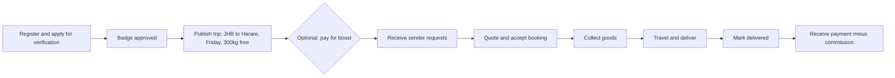
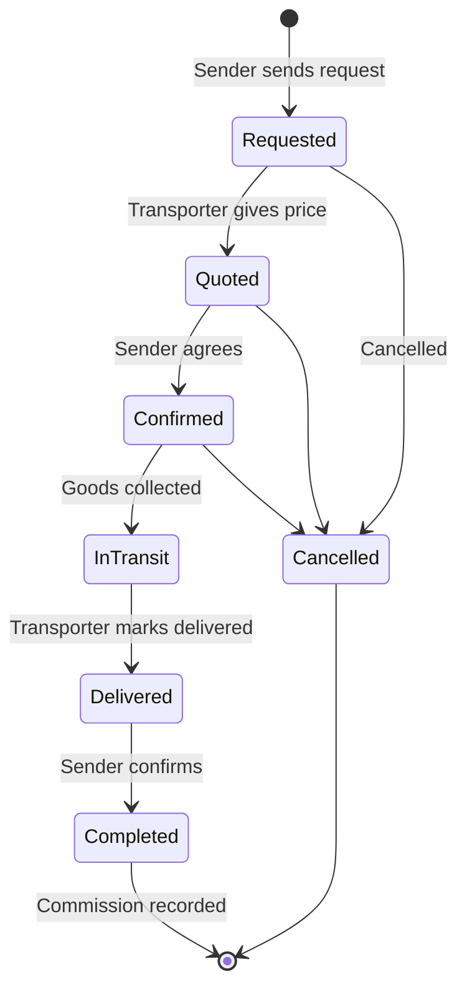
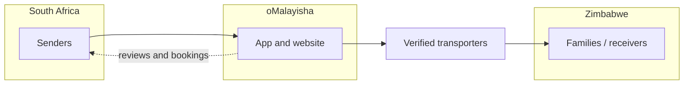

# oMalayisha — Business Plan for Partners

**Version:** 1.0  
**Date:** June 2026  
**Status:** Pre-launch / Partner review  
**Confidential:** For partners and stakeholders

---

## What is oMalayisha?

**oMalayisha** is a mobile app and website that connects two groups of people:

1. **Senders** — Zimbabweans in South Africa who need to send groceries, furniture, clothing, or parcels home to Zimbabwe.
2. **oMalayisha** — Independent transporters who drive goods from South Africa to Zimbabwe and back.

Today, these connections happen mostly through **WhatsApp groups, Facebook, and word of mouth**. There is no trusted, central place to find a reliable transporter, agree on a price, and keep a record of the booking.

**oMalayisha fixes that.** We are a **connection and trust platform** — not a transport company. Transporters stay independent; we help people find each other, verify who is trustworthy, and earn a fair fee when deliveries succeed.

---

## 1. Executive Summary

| | |
|---|---|
| **The opportunity** | Hundreds of thousands of cross-border deliveries every month, with no dominant platform |
| **First focus** | Johannesburg / Pretoria → Harare / Bulawayo |
| **Who pays** | Transporters (oMalayisha) — senders use the app **free** |
| **How we earn** | Commission on completed deliveries, paid promotions, verification fees |
| **Our advantage** | Verified transporters, reviews by route, booking history — better than random WhatsApp posts |

---

## 2. The Problem

### For people sending goods (in South Africa)

| Problem | Why it hurts |
|---------|--------------|
| No single place to find transporters | Hours scrolling group chats |
| Hard to know who to trust | Scams, lost goods, no accountability |
| Unclear pricing | No standard rates; endless haggling |
| Poor coordination | Pickup times, weight limits, and suburbs unclear |
| Family left guessing | No update on when goods will arrive in Zimbabwe |

### For families receiving goods (in Zimbabwe)

| Problem | Why it hurts |
|---------|--------------|
| Unpredictable arrivals | Cannot plan to collect goods |
| No updates | "Has the bag left Johannesburg yet?" |
| Disputes | Hard to prove what was sent vs what arrived |

### For transporters (oMalayisha)

| Problem | Why it hurts |
|---------|--------------|
| Unsteady work | Busy one month, quiet the next |
| Reputation stuck in private chats | New customers cannot find them |
| Price wars in groups | Everyone undercuts in public |
| Too much admin | Dozens of WhatsApp conversations to manage |

### Today vs tomorrow

| Today (WhatsApp / Facebook) | Tomorrow (oMalayisha) |
|-----------------------------|------------------------|
| No verification | Verified transporters with ID and vehicle checks |
| No proper search | Search by route, date, and price |
| No booking record | Confirmed booking in the app |
| No platform reputation | Reviews for each route (e.g. JHB → Bulawayo) |

**The real problem is not moving goods — people already do that every day. The problem is finding someone trustworthy and coordinating the trip without stress.**

---

## 3. Our Solution

oMalayisha is a **two-sided marketplace**:

1. **Senders** post what they need to send (or browse upcoming trips).
2. **Transporters** publish when they are travelling, how much space they have, and their price guide.
3. Both sides **chat in the app**, agree on a price, and **confirm the booking**.
4. After delivery, the sender **leaves a review** — building trust for the next person.

### What we promise each group

| Who | Promise |
|-----|---------|
| **Senders** | Find a verified oMalayisha going to your area — free, fast, trusted |
| **oMalayisha** | Get more customers on your route — pay when you earn, or pay for extra visibility |
| **Receivers** (later) | Know who is carrying your goods and when to expect them |

### We are NOT a logistics company

We do not own trucks or employ drivers. We connect people and keep a trusted record of who travelled with what — like Airbnb connects guests and hosts without owning properties.

### How we compare to alternatives

| Alternative | Weakness |
|-------------|----------|
| WhatsApp groups | No search, no verification, no history |
| Facebook Marketplace | Not built for routes; many scams |
| DHL / formal couriers | Too expensive for groceries and furniture |
| Word of mouth only | Does not scale; new transporters struggle |

---

## 4. Who Uses the Platform

### Mike — Sender (Johannesburg)

- Works in SA, sends groceries to family in Bulawayo every month
- Uses WhatsApp daily; careful with money
- Wants: someone reliable, clear departure date, fair price
- Will **not** pay to browse the app

### Blessing — Transporter (oMalayisha)

- Drives Johannesburg → Bulawayo 2–4 times per month
- Carries 500kg–1 ton of mixed goods
- Wants: more customers, repeat business, less time in group chats
- **Will pay** for customers if it clearly brings income

### Grace — Receiver (Bulawayo)

- Collects goods for her family
- Wants: a heads-up when goods are on the way
- Will use notification features as we add them in Phase 2

---

## 5. How We Make Money

**Senders never pay to use the app.** All early revenue comes from **transporters (oMalayisha)**.

### Revenue stream 1: Commission on completed deliveries *(main income)*

| | |
|---|---|
| **Rate** | 5–10% of the agreed trip price |
| **When charged** | Only after delivery is confirmed |
| **Example** | R800 trip → R40–80 to oMalayisha platform |

**Why this works:** We only earn when the transporter earns. Everyone is aligned.

| Stage | How it works |
|-------|--------------|
| Launch | We track bookings manually and invoice transporters monthly |
| Growth | Payment held safely in app until delivery; commission taken automatically |
| Scale | Smarter pricing on busy routes; discounts for top transporters |

### Revenue stream 2: Featured / boosted listings

Transporters pay to appear **at the top** when someone searches e.g. "Johannesburg → Harare, leaving Friday."

| | |
|---|---|
| **Price** | R50–200 per boost (depends on route demand) |
| **Duration** | 24–72 hours, or until the trip departs |
| **Familiar idea** | Like boosting a post on Facebook Marketplace |

### Revenue stream 3: Verification badge

Transporters pay for a **"Verified oMalayisha"** badge after we check:

- ID or passport  
- Driver's licence  
- Vehicle registration and photos  
- References from previous customers  

| | |
|---|---|
| **Price** | R200–500 per year |
| **Value** | This is our main difference from WhatsApp — trust sells |

### Revenue at a glance

| Income source | Who pays | When |
|---------------|----------|------|
| Commission (5–10%) | Transporter | After confirmed delivery |
| Featured boost | Transporter | Upfront |
| Verification badge | Transporter | Yearly |

### Example: what the business could earn (Year 1 target, one route)

*Assumptions: 400 completed trips per month, average trip R700, 8% commission, 20 boosts at R100, 50 new verifications per year at R350*

| Income line | Per month (ZAR) |
|-------------|-----------------|
| Commission | R22,400 |
| Boosts | R2,000 |
| Verification (spread over year) | ~R1,458 |
| **Total** | **~R25,858** |

If we grow to 2,000 trips per month, commission alone could exceed **R112,000 per month**.

---

## 6. What We Will Build (and When)

### Phase 1 — First 3 months: "Trust + Match"

**For senders**

- Sign up with phone number  
- Post what they need sent (from, to, date, weight)  
- Browse and search upcoming trips  
- Chat with transporters and confirm booking  
- Leave a review after delivery  
- Share trips via WhatsApp link  

**For transporters**

- Create a profile (routes, vehicle capacity, photo)  
- Publish upcoming trips (date, route, space available, price guide)  
- Accept or decline booking requests  
- Apply for verified badge  
- Pay for featured listing (manual at first)  

**Behind the scenes (our team)**

- Approve verifications  
- Handle disputes and moderate reviews  
- Track commissions owed  

### Phase 2 — Months 4–9: Growth

- Safe in-app payments (money held until delivery confirmed)  
- SMS / WhatsApp updates for receivers: "Your goods are on the way"  
- Photo proof at pickup and delivery  
- Favourite transporters and repeat bookings  
- In-app boost purchases  
- App in English, Shona, and Ndebele  

### Phase 3 — Months 10–18: Scale

- Faster automated verification  
- Formal dispute process  
- Insurance partner (optional extra for senders)  
- Partnerships with churches, NGOs, and community groups  
- Coverage of all major South Africa → Zimbabwe routes  

### What matters most at launch

| Feature | Why it matters |
|---------|----------------|
| Trip listings + search | Core reason people open the app |
| Verification badge | Trust — our edge over WhatsApp |
| In-app chat | Keeps conversation and booking on platform |
| Reviews | Builds reputation over time |
| Commission tracking | How we get paid |

---

## 7. How It Works — Step by Step

### Sender journey (from download to review)

```mermaid
flowchart LR
    A[Download app] --> B[Post request or browse trips]
    B --> C[Search: JHB to Bulawayo, 15 Dec]
    C --> D[View verified transporters]
    D --> E[Chat and agree price]
    E --> F[Confirm booking]
    F --> G[Hand over goods at pickup]
    G --> H[Family receives goods]
    H --> I[Mark delivered and leave review]
    I --> J[Platform earns commission]
```

### Transporter journey (from sign-up to payout)

### Booking status — what happens when

### Simple picture of the platform

---

## 8. Trust, Safety, and Legal

### Our legal role

oMalayisha is a **marketplace** — we connect people. We do not employ transporters or take possession of goods. Terms of service will make this clear.

- Transporters are independent operators  
- Users must follow customs and tax rules for cross-border goods  
- We will work with a South African lawyer before public launch (privacy law / POPIA)  

### How we protect users

- **Verification** — ID, licence, vehicle, and references before a badge is issued  
- **Reviews** — only after a real completed booking  
- **Report and block** — bad actors can be removed  
- **Dispute support** — chat history helps resolve disagreements  
- **Secure data** — personal information and ID copies stored safely  

---

## 9. Go-to-Market Plan: Zero to Hero

### Phase 0 — Validation (Weeks 1–4, no app yet)

| Action | Goal |
|--------|------|
| Talk to 15 senders and 10 transporters | Confirm the problem is real |
| Observe WhatsApp / Facebook groups | Map busiest routes |
| Manually match 10 deliveries ourselves | Prove people will use this |
| Simple landing page + waitlist | 200+ interested signups |
| Pick first route | e.g. Johannesburg → Harare |

**Pass criteria:** 10 successful manual matches, at least 3 people who want to use it again.

### Phase 1 — MVP (Months 1–3)

| Action | Goal |
|--------|------|
| Launch mobile app (beta) | Core features working |
| Onboard 20 verified transporters | Enough supply to choose from |
| Soft launch in 2–3 community groups | 100 beta users |
| First commission invoices | Proof of revenue |
| 50+ reviews | Social proof |

**Pass criteria:** 100 completed bookings, less than 5% disputes, happy users (NPS above 40).

### Phase 2 — Own the first corridor (Months 4–9)

- Safe payments in app  
- Automated boosts  
- Expand to Cape Town, Durban, Pretoria routes  
- Partner with community leaders and churches  

**Pass criteria:** 500+ bookings per month on main route, 60% of transporters still active.

### Phase 3 — National scale (Months 10–18)

- All major SA → Zimbabwe routes  
- Faster verification  
- Local languages in the app  
- Insurance option  

**Pass criteria:** 2,000+ bookings per month, platform earning R100k+ per month from commission.

### Phase 4 — Market leader (18+ months)

- Known brand for RSA–Zimbabwe informal logistics  
- Partnerships with remittance and community organisations  
- Possible expansion to other neighbouring countries  

### Route rollout order

1. Johannesburg / Pretoria → Harare / Bulawayo  
2. Cape Town → Harare / Bulawayo  
3. Durban → Harare  
4. Other Zimbabwe towns (Mutare, Gweru, Masvingo)  

---

## 10. How We Measure Success

### The one number that matters most

**Completed deliveries per month.**

### Marketplace health (target by month 6)

| Measure | Target |
|---------|--------|
| Active senders per month | 2,000+ |
| Active transporters | 150+ |
| Completed bookings | 500+ |
| Trips that get at least one booking | More than 40% |
| Average time to find a match | Under 24 hours |
| Bookings that get a review | More than 60% |
| Average transporter rating | Above 4.2 out of 5 |

### Money measures

| Measure | Meaning |
|---------|---------|
| **GMV** | Total value of all completed bookings through the app |
| **Take rate** | Our revenue as a % of GMV |
| **Revenue per transporter** | How much each active transporter pays us per month |

### Trust measures

| Measure | Target |
|---------|--------|
| Disputes | Less than 3% of bookings |
| Bookings with verified transporters | More than 70% |
| Deals done outside the app | Reduce over time with safe payments |

---

## 11. Risks and How We Handle Them

| Risk | How likely | Impact | Our response |
|------|------------|--------|--------------|
| People agree in app then pay cash offline | High | High | Safe payments, reviews only for in-app bookings |
| Senders don't adopt the app | Medium | High | Free for senders; market in WhatsApp groups |
| Transporters resist commission | Medium | Medium | Start at 5%; prove we bring real customers |
| Theft or fraud | Medium | High | Verification, reviews, disputes, insurance later |
| Legal / regulatory issues | Low | High | Lawyer-reviewed terms; we don't carry goods |
| Cash vs digital payment habits | High | Medium | Start with booking records; add payments gradually |
| December holiday rush | High | Medium | Higher boost prices; help transporters plan capacity |

---

## 12. Team We Need

### Starting team (first 6 months)

| Role | Focus |
|------|-------|
| **CEO / Product lead** | Vision, partnerships, community marketing |
| **Technical lead** | Build and run the app |
| **Developer(s)** | Ship features quickly |
| **Operations / Community** | Onboard transporters, verify IDs, support users |
| **Legal advisor** (part-time) | Privacy, terms, marketplace rules |

### As we grow (6–18 months)

Add: more developers, customer support (English + local languages), marketing lead, data analyst.

---

## 13. Budget Overview (Indicative)

*Rough planning numbers — refine with real quotes.*

| Phase | Duration | Estimated cost (ZAR) | What it covers |
|-------|----------|----------------------|----------------|
| Validation | 1 month | R20,000 – R50,000 | Landing page, travel, community events |
| Build MVP | 3 months | R300,000 – R600,000 | App development, design |
| Run MVP | 6 months | R150,000 – R300,000 | Hosting, SMS, support, marketing |
| Growth phase | 6 months | R500,000 – R1,000,000 | Payments, more staff, wider launch |

---

## 14. Glossary

| Term | Meaning |
|------|---------|
| **oMalayisha** | Someone who transports goods between SA and Zimbabwe (everyday term in the community) |
| **Sender** | Person in SA sending goods |
| **Receiver** | Person in Zimbabwe collecting goods |
| **Corridor** | A route pair, e.g. Johannesburg to Harare |
| **Trip listing** | A transporter's posted run — date, route, space available |
| **Delivery request** | A sender's post saying what they need sent |
| **GMV** | Total booking value flowing through the platform |
| **Boost** | Paid promotion so a listing appears at the top of search |
| **Commission** | Our share of a completed booking (5–10%) |

---

## 15. Next Steps for Partners

1. Agree on the first route to launch (recommended: Johannesburg → Harare / Bulawayo)  
2. Confirm roles, equity, and funding for validation and MVP  
3. Appoint legal counsel for privacy and terms of service  
4. Start validation interviews this week (no app required)  
5. Build MVP once validation passes (10 successful manual matches)  

---

**oMalayisha** — *The trusted way to find oMalayisha going home.*

*Document version 1.0 — June 2026 — Confidential*
